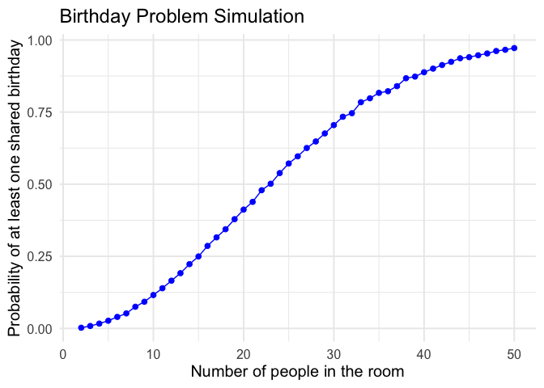
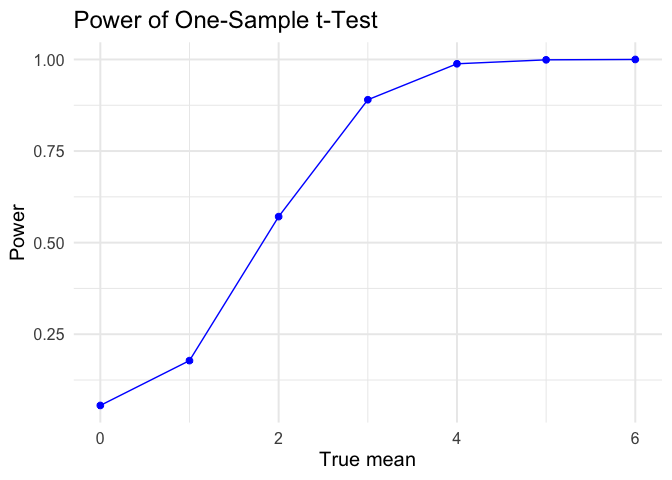
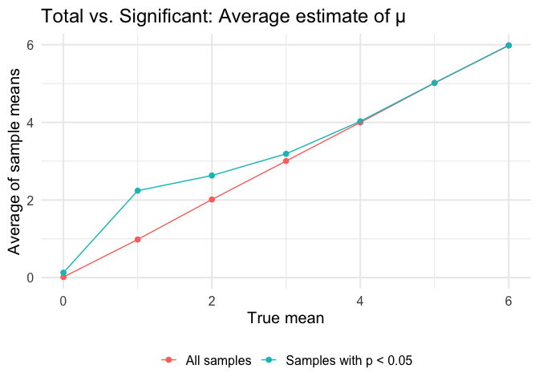
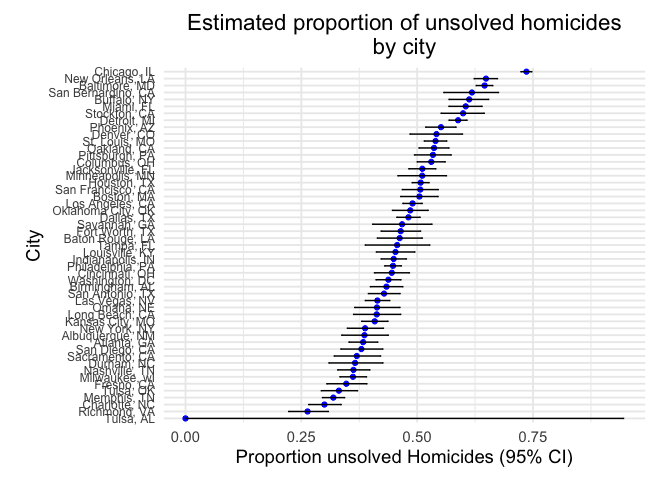

p8105_hw5_jw3638
================

``` r
library(tidyverse)
```

    ## ── Attaching core tidyverse packages ──────────────────────── tidyverse 2.0.0 ──
    ## ✔ dplyr     1.1.4     ✔ readr     2.1.5
    ## ✔ forcats   1.0.0     ✔ stringr   1.5.1
    ## ✔ ggplot2   3.5.2     ✔ tibble    3.3.0
    ## ✔ lubridate 1.9.4     ✔ tidyr     1.3.1
    ## ✔ purrr     1.1.0     
    ## ── Conflicts ────────────────────────────────────────── tidyverse_conflicts() ──
    ## ✖ dplyr::filter() masks stats::filter()
    ## ✖ dplyr::lag()    masks stats::lag()
    ## ℹ Use the conflicted package (<http://conflicted.r-lib.org/>) to force all conflicts to become errors

``` r
library(broom)
```

# Problem 1: Birthday Simulation

# Set up the simulation function

``` r
bday_sim = function(n_room) {
  birthdays = sample(1:365, n_room, replace = TRUE)
  repeated_bday = length(unique(birthdays)) < n_room
  return(repeated_bday)
}

#Check true/false function
bday_sim(5)
```

    ## [1] FALSE

# Run simulation 10,000+ times for each group size

``` r
set.seed(1) # so every time you knit the document, you’ll get the same simulation output.

bday_sim_results =
  expand_grid(
    bdays = 2:50,
    iter = 1:10000
  ) |>
  mutate(
    result = map_lgl(bdays, bday_sim)
  ) |>
  group_by(bdays) |>
  summarize(prob_repeat = mean(result)) #Calculates the estimated probability of shared birthdays
```

This code runs 10,000 birthday simulations for each group size from 2 to
50, checks whether each simulation contains at least one matching
birthday, and then computes the probability of a match by averaging the
TRUE/FALSE outcomes.

# Plot the results

``` r
bday_sim_results |>
  ggplot(aes(x = bdays, y = prob_repeat)) +
  geom_point(color = "blue", size = 2) +
  geom_line(color = "blue") +
  labs(
    title = "Birthday Problem Simulation",
    x = "Number of people in the room",
    y = "Probability of at least one shared birthday"
  ) +
  theme_minimal(base_size = 15)
```

<!-- -->
This simulation illustrates how quickly the probability of a shared
birthday grows as the number of people increases. Even though there are
365 possible birthdays, a group needs only about 23 (just under 25)
people for there to be a 50% chance of a match. By the time the group
reaches 50 people, the probability of a shared birthday is more than
90%.

This example is useful because it highlights how probability is
sometimes not intuitive. Events that seem rare (like two people sharing
a birthday) become surprisingly likely when many individuals draw from
the same limited set of outcomes.

# Problem 2: Power, sample size, effect size

``` r
set.seed(2) # So that Problem 2 does not depend on problem 1 (randomness is reproducible)
```

# Set up the function to simulate a dataset and t-test

``` r
sim_ttest = function(mu, n = 30, sigma = 5) {
  
  sim_data = tibble(
    x = rnorm(n, mean = mu, sd = sigma)
  )
  
  # Set mu = 0
  test_out = t.test(sim_data$x, mu = 0) |> broom::tidy()
  
  # To return the results:
  tibble(
    mu_true = mu,
    mu_hat = test_out$estimate,
    p_value = test_out$p.value
  )
}
```

Testing it

``` r
sim_ttest(mu = 0)
```

    ## # A tibble: 1 × 3
    ##   mu_true mu_hat p_value
    ##     <dbl>  <dbl>   <dbl>
    ## 1       0   1.14   0.295

``` r
sim_ttest(mu = 3)
```

    ## # A tibble: 1 × 3
    ##   mu_true mu_hat p_value
    ##     <dbl>  <dbl>   <dbl>
    ## 1       3   2.82  0.0115

Run 5000 simulations for each mu from 0 to 6

``` r
ttest_sims =
  expand_grid(
    mu = 0:6, # Repeat the above for 𝜇={1,2,3,4,5,6}
    iter = 1:5000
  ) |>
  mutate(
    results = map(mu, sim_ttest)
  ) |>
  unnest(results)
```

# Compute power for each true mu

``` r
power_df =
  ttest_sims |>
  group_by(mu_true) |>
  summarize(
    power = mean(p_value < 0.05)
  )
```

# plot power curve (power vs effect size)

``` r
power_df |>
  ggplot(aes(x = mu_true, y = power)) +
  geom_point(color = "blue", size = 2) +
  geom_line(color  = "blue") +
  labs(
    title = "Power of One-Sample t-Test",
    x     = "True mean",
    y     = "Power"
  ) +
  theme_minimal(base_size = 15) # Make wording more visible
```

<!-- --> he
power curve begins at μ = 0 with a rejection rate of about 0.05, which
reflects the expected Type I error rate given the α = 0.05 significance
threshold. The plot shows that statistical power increases sharply as
the true mean increases. A lower true mean (between 0 to 2), power is
lower around 20-60%, meaning the t-test frequently fails to detect these
smaller effect sizes with only n = 30 and sigma = 5. Once mu reaches
around 3, power rises above 90%, and for mu ≥ 4, power is around 100%,
indicating that the test almost always rejects the null when the true
effect is large.

# Calculate mean overall and mean only when p\<0.05 (among rejections)

``` r
mu_estimates =
  ttest_sims |>
  group_by(mu_true) |>
  summarize(
    mean_mu_hat = mean(mu_hat), # all samples
    mean_mu_hat_reject = mean(mu_hat[p_value < 0.05]) # only significant samples/rejections of the null
  )
```

# Long format for plot

``` r
mu_estimates_long =
  mu_estimates |>
  pivot_longer(
    cols = c(mean_mu_hat, mean_mu_hat_reject),
    names_to = "type",
    values_to = "mean_est"
  ) |>
  mutate(
    type = recode(type, 
                  mean_mu_hat = "All samples",
                  mean_mu_hat_reject = "Samples with p < 0.05")
  )
```

# Plot mu overall vs. mu among significant results

``` r
mu_estimates_long |>
  ggplot(aes(x = mu_true, y = mean_est, color = type)) +
  geom_point(size = 2) +
  geom_line() +
  labs(
    title = "Total vs. Significant: Average estimate of μ",
    x     = "True mean",
    y     = "Average of sample means",
    color = NULL # Looks better without
  ) +
  theme_minimal(base_size = 15) +
  theme(legend.position = "bottom") # Moved it to the bottom so the graph is spaced out
```

<!-- -->
Across all samples (red line), the average of the estimated means
closely matches the true mean for every value, which reflects that the
sample mean is an unbiased estimator of the true mean under the Normal
distribution. When we restrict to only the samples for which the null
hypothesis was rejected (p \< 0.05), the average sample mean (blue line)
is noticeably higher than the true mean for small effect sizes (mu=0-2).
As the true mean becomes large (mu ≥ 3), almost all samples are
significant, so the two curves converge again. This demonstrates that
conditioning on statistical significance inflates the estimated effect
size, especially when power is low.

# Problem 3: Homicide Data

# Load data

``` r
homicide_df = read_csv("data/homicide-data.csv", na = c("NA", ".", "")) |>
  janitor::clean_names() 
```

    ## Rows: 52179 Columns: 12
    ## ── Column specification ────────────────────────────────────────────────────────
    ## Delimiter: ","
    ## chr (9): uid, victim_last, victim_first, victim_race, victim_age, victim_sex...
    ## dbl (3): reported_date, lat, lon
    ## 
    ## ℹ Use `spec()` to retrieve the full column specification for this data.
    ## ℹ Specify the column types or set `show_col_types = FALSE` to quiet this message.

``` r
summary(homicide_df)
```

    ##      uid            reported_date       victim_last        victim_first      
    ##  Length:52179       Min.   : 20070101   Length:52179       Length:52179      
    ##  Class :character   1st Qu.: 20100318   Class :character   Class :character  
    ##  Mode  :character   Median : 20121216   Mode  :character   Mode  :character  
    ##                     Mean   : 20130899                                        
    ##                     3rd Qu.: 20150911                                        
    ##                     Max.   :201511105                                        
    ##                                                                              
    ##  victim_race         victim_age         victim_sex            city          
    ##  Length:52179       Length:52179       Length:52179       Length:52179      
    ##  Class :character   Class :character   Class :character   Class :character  
    ##  Mode  :character   Mode  :character   Mode  :character   Mode  :character  
    ##                                                                             
    ##                                                                             
    ##                                                                             
    ##                                                                             
    ##     state                lat             lon          disposition       
    ##  Length:52179       Min.   :25.73   Min.   :-122.51   Length:52179      
    ##  Class :character   1st Qu.:33.77   1st Qu.: -96.00   Class :character  
    ##  Mode  :character   Median :38.52   Median : -87.71   Mode  :character  
    ##                     Mean   :37.03   Mean   : -91.47                     
    ##                     3rd Qu.:40.03   3rd Qu.: -81.76                     
    ##                     Max.   :45.05   Max.   : -71.01                     
    ##                     NA's   :60      NA's   :60

The raw dataset contains 52,179 rows, with each row representing a
single homicide case reported in one of 50 large U.S. cities between
2007 and 2017. The dataset includes key variables such as case
identifier, the date the homicide was reported, victim’s name,
demographic characteristics of the victim, location of the homicide,
geographic coordinates of the incident, and case outcome.

# Create city_state and summarize total and unsolved cases

``` r
city_summary =
  homicide_df |>
  mutate(
    city_state = str_c(city, ", ", state),
    unsolved = disposition %in% c("Closed without arrest", "Open/No arrest") # Unsolved includes both of these variables
  ) |>
  group_by(city_state) |>
  summarize(
    total = n(),
    unsolved = sum(unsolved)
  )
```

Print a summary table:

``` r
city_summary |>
  knitr::kable(
    col.names = c("City, State", "Total", "Unsolved")
  )
```

| City, State        | Total | Unsolved |
|:-------------------|------:|---------:|
| Albuquerque, NM    |   378 |      146 |
| Atlanta, GA        |   973 |      373 |
| Baltimore, MD      |  2827 |     1825 |
| Baton Rouge, LA    |   424 |      196 |
| Birmingham, AL     |   800 |      347 |
| Boston, MA         |   614 |      310 |
| Buffalo, NY        |   521 |      319 |
| Charlotte, NC      |   687 |      206 |
| Chicago, IL        |  5535 |     4073 |
| Cincinnati, OH     |   694 |      309 |
| Columbus, OH       |  1084 |      575 |
| Dallas, TX         |  1567 |      754 |
| Denver, CO         |   312 |      169 |
| Detroit, MI        |  2519 |     1482 |
| Durham, NC         |   276 |      101 |
| Fort Worth, TX     |   549 |      255 |
| Fresno, CA         |   487 |      169 |
| Houston, TX        |  2942 |     1493 |
| Indianapolis, IN   |  1322 |      594 |
| Jacksonville, FL   |  1168 |      597 |
| Kansas City, MO    |  1190 |      486 |
| Las Vegas, NV      |  1381 |      572 |
| Long Beach, CA     |   378 |      156 |
| Los Angeles, CA    |  2257 |     1106 |
| Louisville, KY     |   576 |      261 |
| Memphis, TN        |  1514 |      483 |
| Miami, FL          |   744 |      450 |
| Milwaukee, wI      |  1115 |      403 |
| Minneapolis, MN    |   366 |      187 |
| Nashville, TN      |   767 |      278 |
| New Orleans, LA    |  1434 |      930 |
| New York, NY       |   627 |      243 |
| Oakland, CA        |   947 |      508 |
| Oklahoma City, OK  |   672 |      326 |
| Omaha, NE          |   409 |      169 |
| Philadelphia, PA   |  3037 |     1360 |
| Phoenix, AZ        |   914 |      504 |
| Pittsburgh, PA     |   631 |      337 |
| Richmond, VA       |   429 |      113 |
| Sacramento, CA     |   376 |      139 |
| San Antonio, TX    |   833 |      357 |
| San Bernardino, CA |   275 |      170 |
| San Diego, CA      |   461 |      175 |
| San Francisco, CA  |   663 |      336 |
| Savannah, GA       |   246 |      115 |
| St. Louis, MO      |  1677 |      905 |
| Stockton, CA       |   444 |      266 |
| Tampa, FL          |   208 |       95 |
| Tulsa, AL          |     1 |        0 |
| Tulsa, OK          |   583 |      193 |
| Washington, DC     |  1345 |      589 |

# Baltimore: run prop.test and tidy the output

``` r
baltimore_df =
  city_summary |>
  filter(city_state == "Baltimore, MD")

baltimore_test =
  prop.test(
    x = baltimore_df$unsolved,
    n = baltimore_df$total
  )

baltimore_tidy =
  broom::tidy(baltimore_test)

baltimore_tidy |> 
  select(estimate, conf.low, conf.high) # This gives estimated proportion unsolved, lower CI, upper CI
```

    ## # A tibble: 1 × 3
    ##   estimate conf.low conf.high
    ##      <dbl>    <dbl>     <dbl>
    ## 1    0.646    0.628     0.663

The estimated proportion of homicides that are unsolved in Baltimore is
approximately 64.6%. The 95% confidence interval ranges from 0.628 to
0.663, meaning that based on this sample of cases, we can be reasonably
confident that between about 62.8% and 66.3% of homicide cases in
Baltimore remain unsolved. Because the interval is very narrow, the
estimate is precise because of the large number of cases.

The warning from prop.test() (“Chi-squared approximation may be
incorrect”) occurs in cities with very small sample sizes and does not
affect the analysis.

# Running prop.test() function for all cities using purrr

``` r
city_results =
  city_summary |>
  mutate(
    prop_test = map2(unsolved, total, prop.test),
    results = map(prop_test, broom::tidy)
  ) |>
  unnest(results) |>
  select(
    city_state, 
    estimate, 
    conf.low, 
    conf.high
  )
```

    ## Warning: There was 1 warning in `mutate()`.
    ## ℹ In argument: `prop_test = map2(unsolved, total, prop.test)`.
    ## Caused by warning in `.f()`:
    ## ! Chi-squared approximation may be incorrect

Let’s look at it

``` r
city_results
```

    ## # A tibble: 51 × 4
    ##    city_state      estimate conf.low conf.high
    ##    <chr>              <dbl>    <dbl>     <dbl>
    ##  1 Albuquerque, NM    0.386    0.337     0.438
    ##  2 Atlanta, GA        0.383    0.353     0.415
    ##  3 Baltimore, MD      0.646    0.628     0.663
    ##  4 Baton Rouge, LA    0.462    0.414     0.511
    ##  5 Birmingham, AL     0.434    0.399     0.469
    ##  6 Boston, MA         0.505    0.465     0.545
    ##  7 Buffalo, NY        0.612    0.569     0.654
    ##  8 Charlotte, NC      0.300    0.266     0.336
    ##  9 Chicago, IL        0.736    0.724     0.747
    ## 10 Cincinnati, OH     0.445    0.408     0.483
    ## # ℹ 41 more rows

Let’s plot it

``` r
city_results |>
  mutate(city_state = fct_reorder(city_state, estimate)) |>
  ggplot(aes(x = city_state, y = estimate)) +
  geom_point(color = "blue") +
  geom_errorbar(aes(ymin = conf.low, ymax = conf.high), width = 0.2) +
  coord_flip() +
  labs(
    title = "Estimated proportion of unsolved homicides\nby city",
    x = "City",
    y = "Proportion unsolved Homicides (95% CI)"
  ) +
  theme_minimal(base_size = 14) +
  theme(
    axis.text.y = element_text(size = 9, lineheight = 2),
    plot.title = element_text(hjust = 0.5),
    plot.margin = margin(t = 10, r = 20, b = 10, l = 20)
  )
```

<!-- -->
The plot shows substantial variation in the proportion of homicides that
remain unsolved across the 50 cities. Chicago, New Orleans, and
Baltimore have the highest estimated proportions of unsolved cases
(around 65–75%), and relatively narrow confidence intervals due to their
large number of total homicides. In contrast, Tulsa (Alabama), Richmond,
and Charlotte have much lower proportions (around 25–30%) and wider
confidence intervals, reflecting smaller case counts and more
uncertainty in the estimates.
